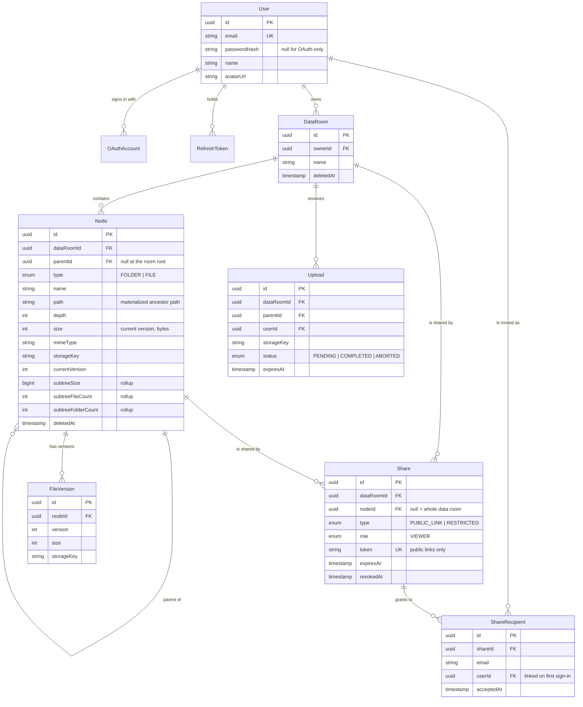

# Data Room

A virtual data room for M&A due diligence: an owner collects documents in a folder tree and grants
read-only access to the other side — either to named people or through a public link.

- **Frontend** — Next.js 16 (App Router) · TypeScript · Tailwind v4 · shadcn/ui · TanStack Query
- **Backend** — NestJS 11 · Prisma 6 · PostgreSQL
- **Storage** — Supabase Storage, addressed through a swappable `StorageProvider` port
- **Auth** — email/password (argon2) plus Google OAuth behind a feature flag; JWT access token +
  rotating refresh token in `httpOnly` cookies

| | URL |
|---|---|
| Web | _(fill in after deploy)_ |
| API | _(fill in after deploy)_ |

Seeded demo accounts: `owner@acme.test` / `guest@acme.test`, password `password123`.
The guest account has a folder shared with it, so permissioned sharing can be checked from both
sides.

---

## What is implemented

**Folders** — create, nest, rename, delete (with a warning that states exactly how many folders,
files and bytes disappear), breadcrumb navigation, per-folder totals.

**Files** — multi-file upload with drag-and-drop and per-file progress, cancel and retry; in-app PDF
viewer; rename with conflict resolution; move to another folder; delete.

**Sharing** — a data room, a folder or a single file can be shared. Two modes: a public link (no
sign-in) and a permissioned share (specific emails). Recipients get read-only access to the item and
everything nested inside it. The owner can revoke either at any time.

**Extras** — search by name across a data room (`Ctrl/⌘ K`), file versioning when a name collides,
light/dark theme, keyboard-operable rows, empty/loading/error states everywhere.

---

## Design decisions

### One `Node` table for both files and folders

Files and folders share a single table with `type: FOLDER | FILE`, an adjacency list (`parentId`)
**and** a materialized path (`path`, e.g. `/rootId/childId/`).

The adjacency list makes "list one folder" a single indexed lookup. The materialized path makes
every *subtree* question a single indexed prefix scan:

- delete a folder → one `UPDATE ... WHERE path LIKE '/a/b/%'`
- move a folder → one `UPDATE` re-roots the whole subtree
- "may this viewer see node X?" → the ancestor ids are already in `X.path`, no recursive query
- search inside a folder → `path LIKE prefix%` narrows the trigram search

Two separate tables would have duplicated all of that logic, and a pure adjacency list would need a
recursive CTE per question.

### Name conflicts are resolved by the database, not by application code

```sql
CREATE UNIQUE INDEX ON "Node" ("dataRoomId", "parentId", lower("name"))
  WHERE "deletedAt" IS NULL AND "parentId" IS NOT NULL;
```

A check-then-insert in the service layer is a race condition under concurrent uploads. The partial
unique index makes the invariant true by construction; the service only decides *what to do* on
violation:

| Strategy | Behaviour |
|---|---|
| `FAIL` | `409` with the offending name — used by rename, so the user stays in control |
| `KEEP_BOTH` | `report.pdf` → `report (1).pdf`, skipping counters already taken |
| `REPLACE` | the upload becomes **version N+1** of the existing file |

The uploader shows the choice up front when the dropped names collide with what is already in the
folder.

### Files never travel through the API

`POST /data-rooms/:id/uploads` records a pending `Upload` row and returns a **presigned PUT URL** per
file. The browser uploads straight to object storage over `XMLHttpRequest` (which is what gives real
`upload.onprogress` numbers), then calls `POST /uploads/confirm`, which creates the `Node` inside a
transaction.

This keeps the API stateless and small — no multipart buffering, no request-body size ceiling, and the
API instance is never on the critical path for the bytes themselves. It also makes cancel trivial:
`xhr.abort()` plus a `DELETE /uploads/:id` that releases the reserved key.

The per-file cap lives in one constant (`MAX_FILE_SIZE_BYTES`, currently 10 MB to fit the Supabase
free tier) and is enforced twice: by the zod schema before a URL is signed, and by the bucket itself.

### One access rule for everything

`AccessService` answers a single question — *what may this caller do with this node?* — and every
controller goes through it:

1. owner of the data room → `READ | WRITE | MANAGE`;
2. otherwise look for an active share whose `nodeId` is the node itself, **any ancestor from
   `node.path`**, or `NULL` (the whole data room);
3. a `PUBLIC_LINK` share matches on the token in `x-share-token`; a `RESTRICTED` share matches on the
   caller's user id or email;
4. the share's `role` maps to permissions through `ROLE_PERMISSIONS`.

Because inheritance is derived from the materialized path, sharing a folder automatically covers
everything created inside it later, with no fan-out writes.

### Soft delete

Deletes stamp `deletedAt` across the subtree instead of removing rows. That buys three things: the
partial unique index frees the name immediately, a viewer who was looking at the item gets a
meaningful `410 Gone` screen instead of a blank page, and undo remains possible. Blobs are removed
right away, since a deleted file is never served again.

### Denormalised subtree rollups

Every folder carries `subtreeSize`, `subtreeFileCount` and `subtreeFolderCount`, maintained inside
the same transaction as the write that changes them (`O(depth)`, and depth is capped at 32). The
delete-confirmation dialog and the folder header read them directly instead of scanning.

### Frontend

- **Server state lives in TanStack Query**; there is no global client store. Query keys are
  centralised in `lib/query-keys.ts` so invalidation is not guesswork.
- **Dialog state lives inside each dialog.** `useDialog(ref)` keeps `isOpen` and the payload local
  and exposes `open(payload)` through an imperative ref, so pages do not carry `open` /
  `onOpenChange` pairs for six modals. Presentational primitives (`NameDialog`, `ConfirmDialog`)
  stay controlled, because they are reused in several contexts.
- **Breadcrumbs are cached in `localStorage`** keyed by data room. Opening a folder or reloading the
  page paints the trail instantly from cache (slightly dimmed) and swaps in the server answer when it
  arrives. The cache is an LRU of 100 entries per room and is only ever a hint — the server response
  always wins.
- **The cookie is first-party.** The web app calls `/api/*` on its own origin and Next.js rewrites
  that to the API. No third-party cookies, so Safari's ITP does not break the session.

---

## Data model



Indexes that carry the workload:

| Index | Serves |
|---|---|
| `(dataRoomId, parentId, deletedAt, type, name)` | folder listing + keyset pagination |
| `(dataRoomId, path text_pattern_ops)` | every subtree operation |
| `UNIQUE (dataRoomId, parentId, lower(name)) WHERE deletedAt IS NULL` | name conflicts |
| `GIN (lower(name) gin_trgm_ops)` | search by name |
| `(dataRoomId, nodeId, revokedAt)` on `Share` | access resolution |

---

## How it scales

### Total size and item count of a folder including its whole subtree

Two mechanisms, and the second is why the first is never on a hot path.

**On demand** — because the path is materialized, the answer is one indexed prefix scan:

```sql
SELECT count(*) AS files, coalesce(sum(size), 0) AS bytes
FROM "Node"
WHERE "dataRoomId" = $1
  AND "path" LIKE $2 || '%'      -- $2 = folder.path || folder.id || '/'
  AND "deletedAt" IS NULL
  AND "type" = 'FILE';
```

**Maintained incrementally** — `subtreeSize` / `subtreeFileCount` / `subtreeFolderCount` are updated
in the same transaction as the write, over the ancestor ids that are already in `path`:

```sql
UPDATE "Node"
SET "subtreeSize" = "subtreeSize" + $delta, ...
WHERE id = ANY($ancestorIds);
```

That is `O(depth)` — bounded by `MAX_FOLDER_DEPTH = 32`, typically under 10 rows. A move subtracts
the moved subtree's weight from the old ancestors and adds it to the new ones. Reads become `O(1)`.

At a scale where write amplification on shared ancestors starts to hurt (a single hot root folder
under heavy concurrent upload), the next step is to stop updating ancestors synchronously: append the
delta to an outbox and fold it in with a background job, accepting eventually-consistent counters.
A nightly reconcile job (the on-demand query above) keeps the rollups honest either way.

### What changes when one data room holds 100 000 files

Nothing about the data model — the design already assumes you never load a data room, only one
folder of it.

- **Listing** is always scoped to one `parentId`. 100 000 files spread over a tree means each
  listing still returns tens of rows, served by `(dataRoomId, parentId, deletedAt, type, name)`.
- **Pagination is keyset, not offset.** The cursor is an opaque encoding of the last row's id and
  Prisma turns it into a row-value comparison, so page 500 costs the same as page 1. `OFFSET 25000`
  would not.
- **Counts come from the rollup columns**, so no `count(*)` over the subtree is needed to render a
  header.
- **Search** uses the trigram GIN index instead of a sequential `ILIKE`. When one data room really is
  a flat 100k-file dump, `pg_trgm` on `lower(name)` still answers in milliseconds; past that, the
  same query shape moves to OpenSearch behind the existing `search` endpoint without touching the
  UI.
- **The UI** already fetches through `useInfiniteQuery`; a single folder with tens of thousands of
  direct children is the one case that needs row virtualisation (`@tanstack/react-virtual` is
  already a dependency) — the API contract does not change.
- **Bulk operations** (delete a 40 000-file folder, export a room) stay single `UPDATE`s in Postgres,
  but blob cleanup moves from the request path to a queue: mark rows deleted synchronously, sweep
  object storage asynchronously.
- **The API does not grow with the data**, because file bytes never pass through it — the browser
  talks to object storage directly.

### How sharing extends to per-user roles (viewer/editor) without remodeling

The model already has the shape; only the enum is deliberately short.

`Share.role` is an enum with `VIEWER` today. `ROLE_PERMISSIONS` maps a role to a permission set, and
every mutating endpoint is already guarded by `Permission.WRITE` rather than by "is owner".

Adding `EDITOR` is therefore:

1. `ALTER TYPE "ShareRole" ADD VALUE 'EDITOR'` (additive, no table rewrite);
2. one line in `ROLE_PERMISSIONS`: `EDITOR: [READ, WRITE]`;
3. a role selector in the share dialog.

No controller, no query and no index changes. Because `AccessService` resolves *all* applicable
shares for a node and takes the strongest, a user who is a viewer on the data room and an editor on
one folder gets exactly that, with no special-casing.

The same seam absorbs organisations: add `Membership(userId, orgId, role)` and `Share.orgId`, then
add one more `OR` branch to the share lookup. `Node` and the permission checks stay untouched.

---

## Running it locally

Prerequisites: Node 22+, pnpm 10+, a PostgreSQL database and a Supabase project (free tier is
enough) for object storage.

```bash
pnpm install

cp apps/api/.env.example apps/api/.env    # fill DATABASE_URL, DIRECT_URL, SUPABASE_*
cp apps/web/.env.example apps/web/.env.local

pnpm db:migrate                            # applies migrations
pnpm db:seed                               # demo users + a shared data room

pnpm dev                                   # api on :4000, web on :3000
```

The private `dataroom-files` bucket is created by the API on first boot if it is missing (name
configurable through `SUPABASE_STORAGE_BUCKET`), so there is nothing to click in the Supabase
console.

Google sign-in is optional. Without `GOOGLE_CLIENT_ID` / `GOOGLE_CLIENT_SECRET` /
`GOOGLE_CALLBACK_URL`, `GET /auth/config` reports `{ providers: { google: false } }`, the API answers
`501` on `/auth/google`, and the web app renders the Google button disabled with a tooltip that says
so. Email/password is unaffected.

### Useful commands

```bash
pnpm typecheck                 # every workspace
pnpm --filter @dataroom/api test
pnpm --filter @dataroom/api db:studio
pnpm build
```

## Deploying

- **Web → Vercel.** Root directory `apps/web`. Set `API_ORIGIN` to the API's public URL; the
  `/api/:path*` rewrite in `next.config.ts` keeps the session cookie first-party.
- **API → Render.** `render.yaml` describes the service; it builds `apps/api/Dockerfile` from the
  repo root. The container runs `prisma migrate deploy` before starting, so the schema is applied on
  every deploy without a manual step, and the storage bucket is created on first boot. Set
  `CORS_ORIGINS` and `WEB_APP_URL` to the Vercel URL.
- **Database + storage → Supabase.** `DATABASE_URL` is the **transaction pooler** string (port 6543,
  `?pgbouncer=true&connection_limit=1`); `DIRECT_URL` is the **direct** one (5432). Both are
  required: Prisma Migrate takes an advisory lock, which pgbouncer's transaction pooling does not
  hold, so migrations must bypass the pooler while the runtime keeps using it.
- Demo data is optional and never runs automatically —
  `pnpm --filter @dataroom/api db:seed` against the deployed database when you want it.
- Render's free plan sleeps after 15 minutes and Supabase pauses an idle project;
  `.github/workflows/keepalive.yml` pings `/health` every 10 minutes to keep both awake. Set the
  repository variable `API_URL` for it.

## API surface

```
GET    /health

POST   /auth/signup | /auth/login | /auth/refresh | /auth/logout
GET    /auth/config | /auth/me | /auth/google | /auth/google/callback

GET    /data-rooms                          POST   /data-rooms
GET    /data-rooms/:id                      PATCH  /data-rooms/:id
DELETE /data-rooms/:id

GET    /data-rooms/:id/nodes?parentId&cursor&limit&sortBy&sortDir
GET    /data-rooms/:id/search?q&scopeId
POST   /data-rooms/:id/folders

GET    /nodes/:id                           PATCH  /nodes/:id
POST   /nodes/:id/move                      DELETE /nodes/:id
GET    /nodes/:id/delete-preview
GET    /nodes/:id/content-url               GET    /nodes/:id/versions

POST   /data-rooms/:id/uploads              POST   /uploads/confirm
DELETE /uploads/:id

POST   /shares                              GET    /shares?dataRoomId&nodeId
DELETE /shares/:id
POST   /shares/:id/recipients               DELETE /shares/:id/recipients/:recipientId
GET    /shared-with-me

GET    /public/shares/:token
GET    /public/shares/:token/nodes
GET    /public/shares/:token/nodes/:id
GET    /public/shares/:token/nodes/:id/content-url
```

Errors carry a stable machine code: `{ statusCode, code, message, details? }`. `404` is returned
instead of `403` for items the caller may not see, so the API does not leak existence. `410` is
returned for something that existed and is now gone — the UI turns that into an explicit "this item
was deleted or your access was revoked" screen instead of an empty list.

## Edge cases that are handled

- Uploading files whose names already exist → resolved up front (keep both / new version), with the
  database as the final arbiter.
- Renaming into an existing name → `409`, the dialog stays open with the message.
- Deleting a folder → the confirmation states the exact number of folders, files and bytes.
- Viewing something that was deleted or un-shared while you were looking at it → `410`, a dedicated
  screen with a way back, and the query cache is invalidated.
- Moving a folder into itself or into its own descendant → `422` before anything is written.
- Nesting deeper than 32 levels, including when a move would push a subtree past the limit → `422`.
- A revoked or expired public link → its own screen explaining which of the two happened.
- Cancelling an upload mid-flight → the transfer is aborted and the reserved storage key released.
- Being invited by email before you have an account → the invite is attached to the user on first
  sign-in.

## Where AI was used

Claude Code was used throughout, mostly for implementation speed: boilerplate CRUD, zod schemas,
shadcn component wiring, first drafts of tests.

The architectural decisions were made and reviewed by hand — the single `Node` table with a
materialized path, name uniqueness as a partial unique index, the two-phase presigned upload, the
`AccessService` resolution rule, and the migration SQL, where the partial and `text_pattern_ops`
indexes are easy to get subtly wrong.
